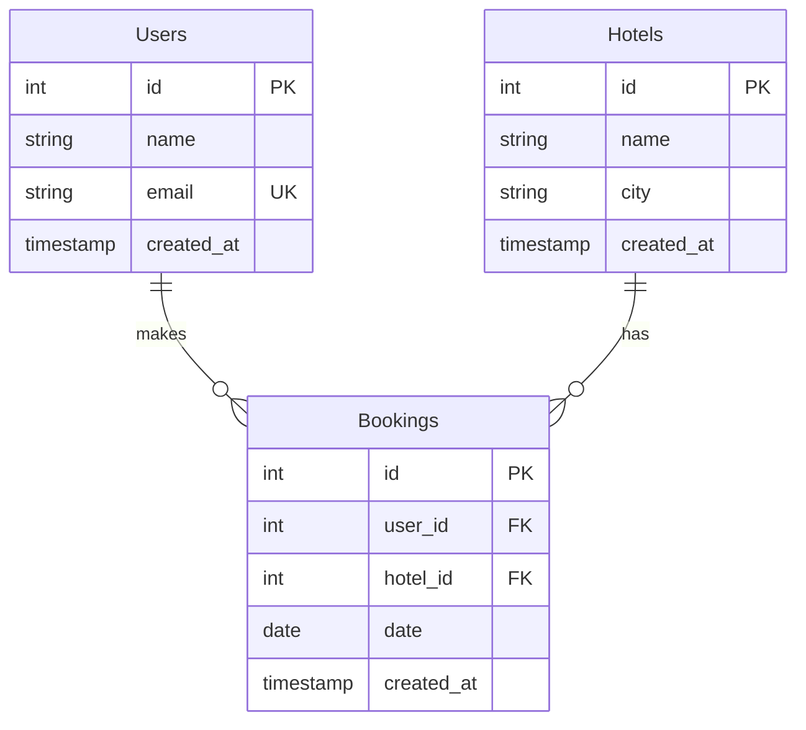
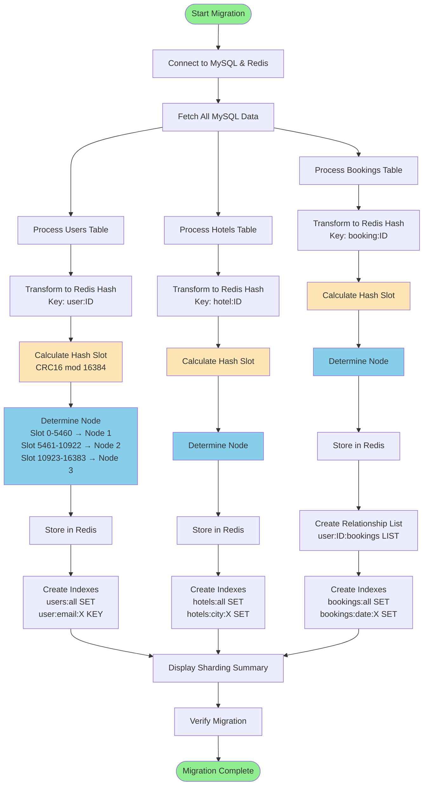
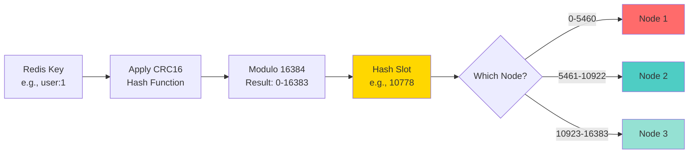
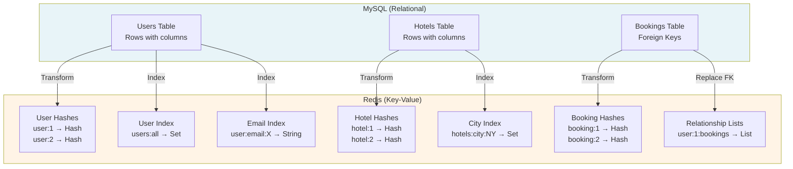
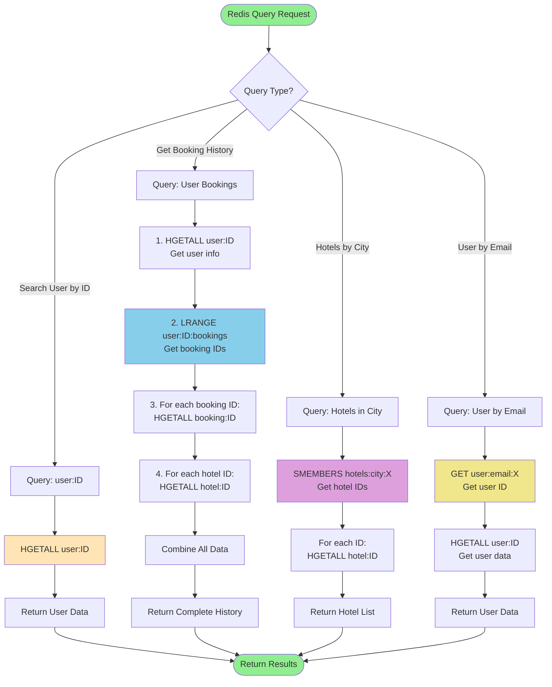
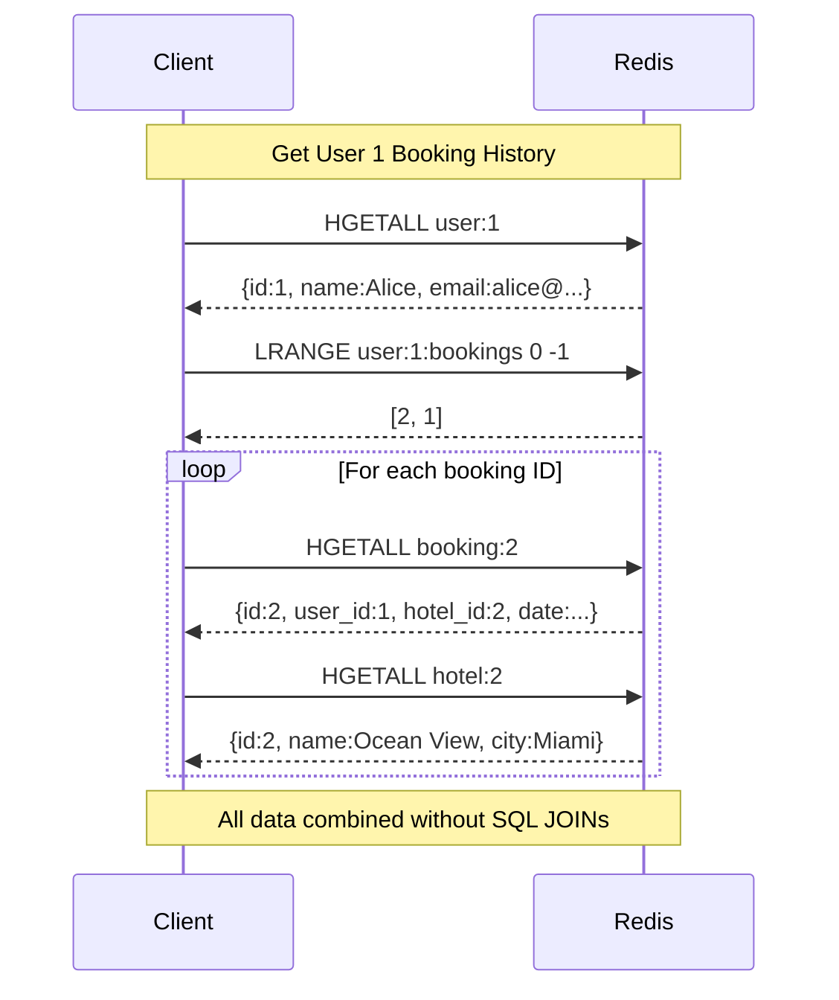
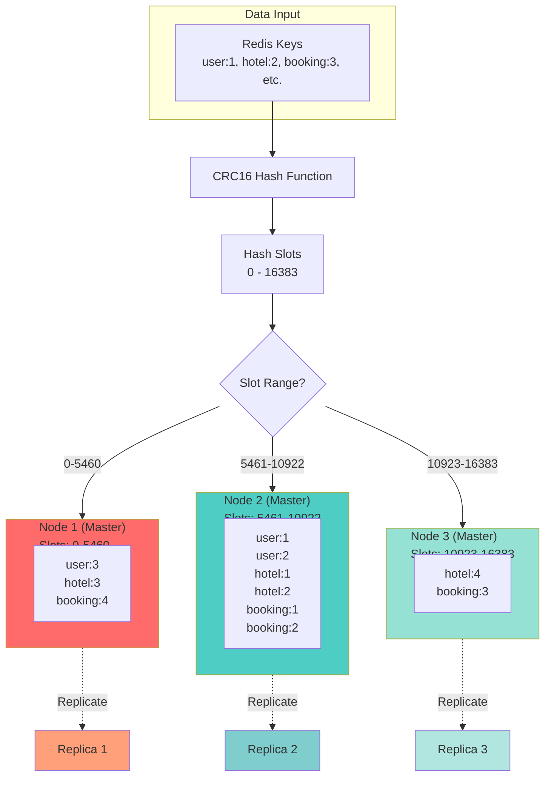
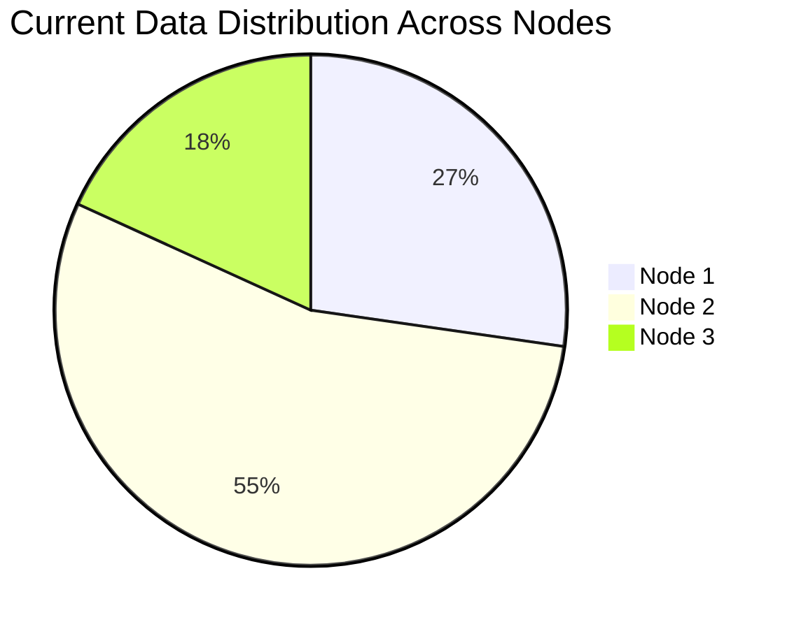
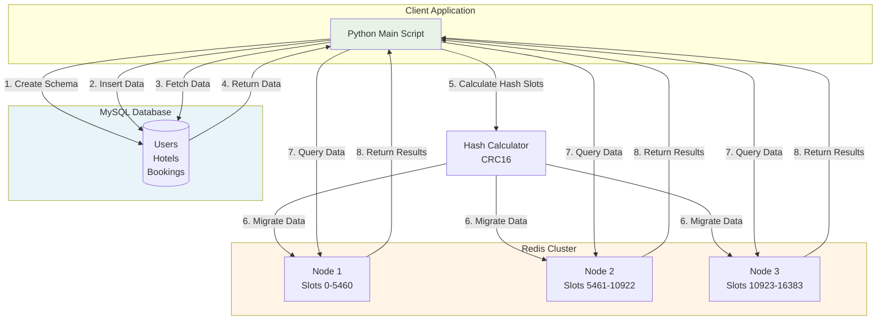

# Hotel Booking System - Architecture & Design

Complete visual guide to MySQL schema, Redis migration, and query operations.

---

## 1. MySQL Database Schema (Relational Design)

### Entity Relationship Diagram

### Relationships
- **Users → Bookings**: One user can make many bookings (1:N)
- **Hotels → Bookings**: One hotel can have many bookings (1:N)
- **Foreign Keys**: 
  - `Bookings.user_id` references `Users.id`
  - `Bookings.hotel_id` references `Hotels.id`

---

## 2. Redis Migration Process

### Data Transformation Flow

### Hash Slot Calculation

---

## 3. Redis Data Structure Mapping

### SQL Tables → Redis Structures

---

## 4. Redis Query Operations (Without MySQL)

### Query Flow Diagram

### Relationship Traversal (Without JOINs)

---

## 5. Cluster Sharding Distribution

### 3-Node Cluster Architecture

### Data Distribution Example

---

## 6. Complete System Architecture

### End-to-End Flow

---

## Key Concepts Summary

### Data Transformation Rules

| MySQL Concept | Redis Equivalent | Example |
|---------------|------------------|---------|
| **Table Row** | Hash | `user:1` → `{id:1, name:Alice, email:...}` |
| **Primary Key** | Key Suffix | `user:1`, `hotel:2`, `booking:3` |
| **Foreign Key** | List/Reference | `user:1:bookings` → `[1, 2, 3]` |
| **Index** | Set | `users:all` → `{1, 2, 3}` |
| **Unique Constraint** | Key Mapping | `user:email:alice@...` → `1` |
| **SQL JOIN** | Multiple Hash Fetches | LRANGE + HGETALL loop |

### Sharding Strategy

1. **Hash Function**: CRC16 (same as Redis Cluster)
2. **Slot Range**: 0-16383 (16,384 total slots)
3. **Distribution**: Evenly across 3 nodes (~5,461 slots each)
4. **Key Format**: `{prefix}:{id}` determines slot
5. **Replication**: Each master has replica(s) for failover

### Query Patterns

1. **Direct Lookup**: `HGETALL user:1`
2. **Index Scan**: `SMEMBERS hotels:city:Miami` → `HGETALL hotel:X`
3. **Relationship Traversal**: `LRANGE user:1:bookings` → `HGETALL booking:X`
4. **Reverse Lookup**: `GET user:email:X` → `HGETALL user:Y`

---

## Implementation Files

- **MySQL Operations**: `modules/mysql_operations.py`
- **Redis Migration**: `modules/redis_migration.py`
- **Redis Queries**: `modules/redis_queries.py`
- **Main Orchestrator**: `main.py`

---

*Generated for Hotel Booking System - Database Migration Project*
