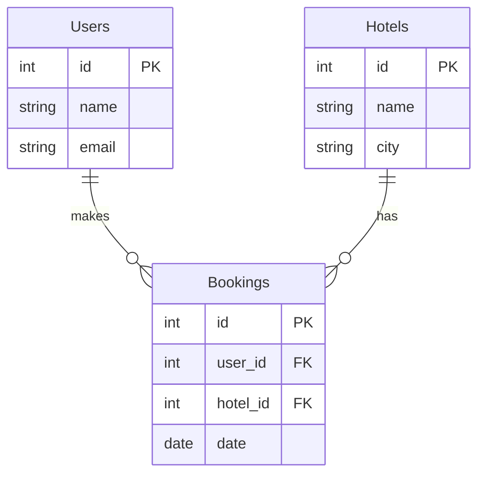
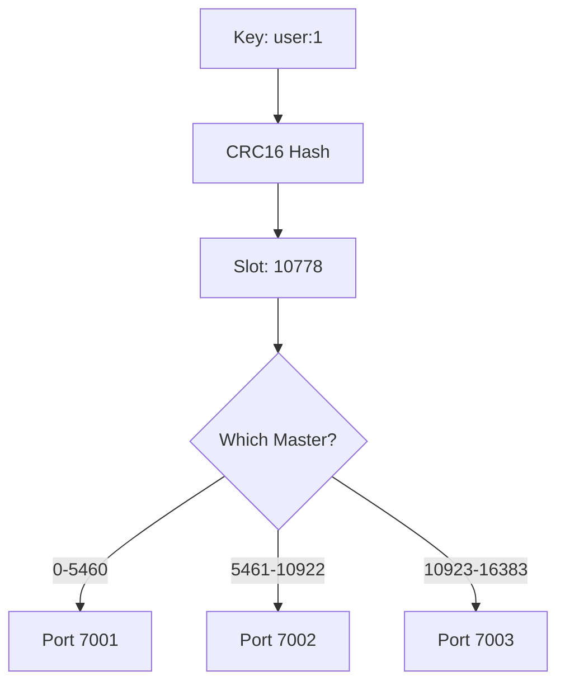
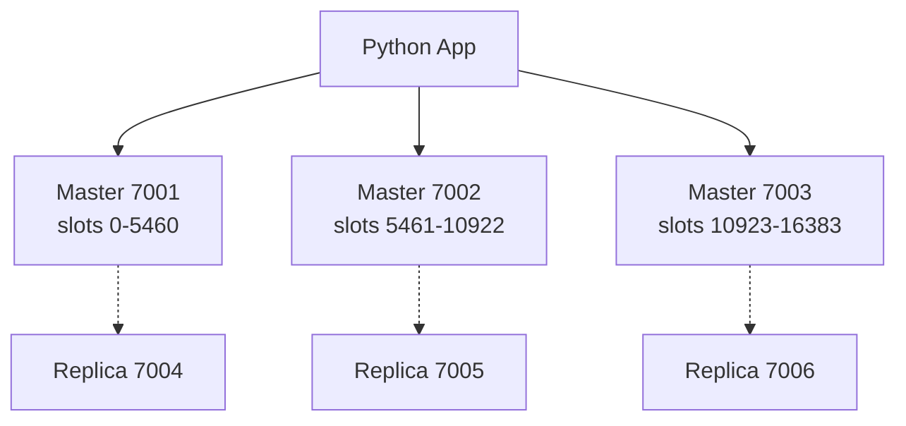

# System Design

## 1. Database Schema

---

## 2. Data Mapping

```mermaid
flowchart LR
    subgraph MySQL
        Row[SQL Row<br/>id, name, email]
        FK[Foreign Key<br/>user_id = 1]
    end
    
    subgraph Redis
        Hash[Hash<br/>user:1 = &#123;id, name, email&#125;]
        List[List<br/>user:1:bookings = &#91;1, 2&#93;]
    end
    
    Row --> Hash
    FK --> List
```

---

## 3. Sharding

---

## 4. Cluster Architecture

---

## 5. Query Flow (No SQL)

---

## 6. Key Files

| File | Purpose |
|------|---------|
| `mysql_operations.py` | Connect to MySQL, create tables |
| `redis_migration.py` | Migrate data, calculate hash slots |
| `redis_queries.py` | Query Redis interactively |
| `main.py` | Run everything |
